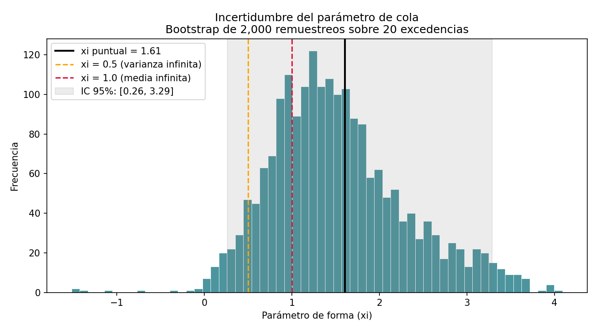

# NFIP Flood Insurance Loss Forecasting

Forecast probabilístico de pérdidas agregadas trimestrales del *National
Flood Insurance Program* (NFIP), combinando modelos de series de tiempo
(SARIMA) para el riesgo "típico" con teoría de valores extremos (EVT) para
el riesgo de cola catastrófica — con dos capas de IA sobre el resultado:
una narrativa ejecutiva generativa (API de Claude) que traduce el número en
un resumen para un comité no técnico, y un agente conversacional con *tool
use* que responde preguntas abiertas sobre el forecast, decidiendo por sí
mismo qué calcular en cada caso.

---

## Tabla de contenidos

1. [Contexto de negocio](#contexto-de-negocio)
2. [Enfoque y arquitectura del modelo](#enfoque-y-arquitectura-del-modelo)
3. [Pipeline paso a paso](#pipeline-paso-a-paso)
4. [Resultado principal](#resultado-principal)
5. [Validación y limitaciones del modelo de cola](#validación-y-limitaciones-del-modelo-de-cola)
6. [Bugs reales encontrados en el camino](#bugs-reales-encontrados-en-el-camino)
7. [Stack técnico](#stack-técnico)
8. [Estructura del repositorio](#estructura-del-repositorio)
9. [Cómo correr el proyecto](#cómo-correr-el-proyecto)
10. [Próximos pasos naturales en producción](#próximos-pasos-naturales-en-producción)
---

## Contexto de negocio

El **National Flood Insurance Program (NFIP)** es el programa federal de
EE.UU. que provee seguro contra inundaciones a propiedades en comunidades
participantes, administrado por FEMA. Existe porque el riesgo de inundación
es, en general, poco atractivo para el mercado de seguros privado: es un
riesgo altamente correlacionado geográfica y temporalmente (un huracán no
afecta una casa a la vez, afecta miles simultáneamente), lo que lo vuelve
difícil de diversificar con las herramientas actuariales tradicionales.

**Por qué importa este forecast en particular:** desde 2017 — después de un
año especialmente costoso con los huracanes Harvey, Irma y María — FEMA
empezó a transferir parte de ese riesgo catastrófico al mercado privado,
comprando reinsurance tradicional y emitiendo bonos de catástrofe. Esa
decisión (cuánta cobertura comprar, y a qué precio vale la pena comprarla)
depende directamente de poder **cuantificar la cola de la distribución de
pérdidas**, no solo el promedio esperado. Este proyecto reconstruye ese
tipo de análisis: no "¿cuánto vamos a pagar en un trimestre normal?", sino
"¿cuál es el rango realista del peor escenario, y con qué probabilidad
ocurre?" — la pregunta que efectivamente enmarca una decisión de reservas o
compra de reinsurance.

---

## Enfoque y arquitectura del modelo

El proyecto separa el problema en dos componentes con dinámicas distintas,
y los combina en vez de forzar un único modelo a hacer las dos cosas:

| Componente | Qué captura | Modelo | Ventana de datos |
|---|---|---|---|
| **Riesgo "típico"** | Estacionalidad y tendencia de frecuencia/severidad de reclamos en un trimestre normal | SARIMA (frecuencia y severidad por separado) | 2004–2025 (post-quiebre estructural) |
| **Riesgo de cola** | Eventos catastróficos raros (huracanes mayores) | Extreme Value Theory — Peaks Over Threshold / GPD | 1978–2025 (histórico completo) |
| **Combinación** | Distribución final de pérdida agregada trimestral | Simulación Monte Carlo (20,000 corridas/trimestre) | — |
| **Traducción a lenguaje natural** | Resumen ejecutivo para un comité no técnico | API de Claude, prompt restringido | — |
| **Consulta agéntica** | Responder preguntas abiertas sobre el forecast, decidiendo qué calcular | API de Claude con *tool use* (loop de decisión) | — |

**Por qué dos ventanas distintas para el mismo dataset:** los modelos
SARIMA necesitan datos recientes y homogéneos para que la estacionalidad y
tendencia estimadas reflejen el régimen actual (ver Paso 3 más abajo). El
EVT, en cambio, necesita la mayor cantidad posible de eventos extremos
históricos para que el parámetro de forma de la cola sea estable — mezclar
regímenes acá es una ventaja, no un problema, porque lo que se está
modelando es precisamente la rareza del evento extremo en sí.

---

## Pipeline paso a paso

### Paso 1 — Extracción de datos

**Fuente:** dataset público `FimaNfipClaims` de OpenFEMA — 2,721,780
reclamos individuales desde 1978.

Se intentó primero paginar la API con `$skip`, pero el servidor devolvía
errores 503 intermitentes a medida que el offset crecía (paginación
profunda degrada el rendimiento en datasets grandes). Se resolvió
descargando el archivo parquet completo de una sola vez.

**Resultado:** 194 trimestres agregados a nivel nacional (1978Q1–2026Q2).
Se excluyen los últimos 2 trimestres en todos los análisis por rezago de
reporte de FEMA (el dataset se actualiza cada 40-60 días).

### Paso 2 — Ajuste por inflación

Comparar severidad de 1978 contra 2025 sin ajustar mezcla inflación
acumulada con cambio real de costo. El dato nominal sugería un aumento de
11x; ajustado a dólares reales de 2025 (CPI-U, BLS), el aumento real fue de
**2.2x** — ~80% del incremento aparente era puramente inflación, no mayor
destructividad real de los eventos.

### Paso 3 — Decisión de ventana temporal (el punto más debatido del proyecto)

**El cuestionamiento inicial:** ¿tiene sentido usar 47 años de historia
para un modelo que predice el año próximo, dado que el cambio climático
probablemente cambió el régimen de riesgo en las últimas décadas?

Se probó primero una ventana arbitraria ("últimos 15 años", 2010-2025) — el
forecast de Q3 daba 47% más alto que con el histórico completo, confirmando
que la elección de ventana sí importa. Pero ese corte de 2010 era una
elección de conveniencia, no evidencia.

**Se reemplazó por detección de quiebre estructural** (algoritmo Pelt,
librería `ruptures`) sobre la severidad real. Resultado: el quiebre real
está en **2004** (no 2010), con la severidad real promedio casi
duplicándose (1.9x) después de ese año. Se adoptó 2004-2025 como ventana
oficial para los modelos SARIMA, con esta evidencia documentada como
justificación.

### Paso 4 — Modelo de frecuencia (SARIMA)

`SARIMAX` orden (1,0,0)(1,1,0,4) sobre log(n_claims), ventana 2004-2025 (88
trimestres). El término estacional (`ar.S.L4`) es significativo (p<0.001):
la estacionalidad de temporada de huracanes es real, no azar. El término
regular (`ar.L1`) no es significativo — el trimestre inmediato anterior no
predice bien el siguiente; lo que sí predice es el mismo trimestre, un año
atrás. Ljung-Box confirma que no quedan patrones sin explicar en los
residuos.

### Paso 5 — Modelo de severidad (SARIMA)

`SARIMAX` orden (1,0,1)(1,1,1,4) sobre log(avg_severity_real), misma
ventana. Hallazgo relevante: con la ventana arbitraria de 2010, el test de
heterocedasticidad daba p=0.03 (significativo, varianza inestable). Con la
ventana correcta de 2004, subió a p=0.25 (ya no significativo) — sugiere
que buena parte de esa señal era artefacto de cortar en un punto que no
correspondía al régimen real, no evidencia genuina de un problema del
modelo.

### Paso 6 — Extreme Value Theory (Peaks Over Threshold)

Ajuste de una distribución Generalizada de Pareto (GPD) sobre las
excedencias por encima del percentil 90 de pérdida trimestral total
($1,006M), usando el histórico completo (1978-2025, 192 trimestres, 20
excedencias).

**Resultado del ajuste:** `xi = 1.605`, `sigma = 519.6`. Un detalle
matemático importante: `xi > 1` implica que la distribución ajustada **no
tiene media teórica finita** — una propiedad real de colas extremadamente
pesadas, no un error de cálculo. Esto tiene una consecuencia directa en el
Paso 7.

**Validación contra la realidad:** P(pérdida trimestral > $4,000M) ≈ 2.4%
(~1 en 10 años) — del mismo orden de magnitud que el 17.2% *anual* que
FEMA estimó internamente antes de su primera compra de reinsurance en 2017.

**Hallazgo estacional dentro del EVT:** 15 de los 20 trimestres
catastróficos históricos (75%) cayeron en Q3. La probabilidad catastrófica
se calculó por trimestre del año en vez de como un promedio parejo:
`{Q1: 0.0, Q2: 0.062, Q3: 0.312, Q4: 0.042}`.

### Paso 7 — Combinación final (Monte Carlo)

20,000 simulaciones por trimestre de forecast, combinando el resultado
base de SARIMA (frecuencia × severidad) con muestras de la cola GPD,
activadas con la probabilidad catastrófica específica de cada trimestre
(no una tasa fija), tomando el máximo entre ambos componentes.

**Decisión importante: se excluyó la "media" del resultado final.** Dado
que `xi > 1`, la media teórica es infinita — cualquier promedio simulado es
inestable y engañoso (ilustrado concretamente: para Q3 2026, la mediana
simulada da $1,220M pero la media da $29,063M). Se reportan mediana, P10,
P90 y P99 en su lugar, que sí son estables y interpretables.

### Paso 8 — Narrativa ejecutiva automática (API de Claude)

El resultado numérico del Paso 7 se traduce a un resumen ejecutivo en
español, pensado para un comité de riesgo sin formación estadística. El
prompt está diseñado con restricciones explícitas, iteradas a partir de
errores reales observados en las primeras corridas:

- No inventar causas de los eventos catastróficos — hablar solo en
  términos de la probabilidad ya calculada.
- No afirmar certeza sobre eventos futuros específicos — distinguir entre
  "esto tiene mayor probabilidad" y "esto va a ocurrir".
- Explicar "mediana" y "P99" en su primera aparición, en lenguaje simple,
  ya que la audiencia (comité ejecutivo) no necesariamente conoce estos
  términos estadísticos.
- Evitar la palabra "razón" para referirse a una proporción o múltiplo,
  porque en español genera ambigüedad real con "motivo/causa" — se
  descubrió este problema al leer una corrida real donde el texto decía
  "la razón es aún mayor" y podía leerse como una explicación causal
  faltante en vez de una proporción numérica.

La llamada usa el modelo `claude-sonnet-5` sin el parámetro `temperature`
(deprecado en la generación actual de modelos Claude — el control de
precisión de la narrativa queda a cargo del diseño del prompt, no de ese
parámetro).

### Paso 9 — Agente conversacional sobre el forecast

Además de la narrativa fija del Paso 8, el proyecto incluye un agente
(`nfip_agent.py`) que responde preguntas abiertas en lenguaje natural sobre
el forecast, decidiendo por sí mismo qué calcular en cada caso — en vez de
generar siempre el mismo tipo de resumen.

**Diferencia clave con la capa de GenAI del Paso 8:** el Paso 8 es una sola
llamada a la API (prompt fijo → texto fijo). El agente, en cambio, tiene
acceso a dos herramientas reales sobre los datos —

- `consultar_trimestre(quarter)` — devuelve los datos exactos de un
  trimestre puntual.
- `filtrar_trimestres_riesgo(umbral)` — devuelve los trimestres cuya
  probabilidad catastrófica supera un umbral dado.

— y corre en un *loop*: el modelo decide qué herramienta usar (o si
necesita encadenar varias), tu código ejecuta esa función real sobre el
CSV, y el resultado vuelve al modelo para que decida el próximo paso o ya
responda en texto. El loop tiene un límite de seguridad de 5 vueltas para
evitar cualquier ejecución descontrolada.

**Ejemplo real de comportamiento agéntico observado:** ante la pregunta
abierta *"¿cuál es el peor trimestre del 2026?"* (sin especificar un
trimestre), el agente decidió por sí mismo consultar los 4 trimestres del
año por separado, en una sola tanda de llamadas en paralelo, y comparó los
resultados para determinar cuál era el peor — una secuencia de pasos que
nunca se programó explícitamente, sino que el modelo planificó a partir de
entender qué necesitaba para responder bien.

---

## Resultado principal

| Trimestre | Prob. evento catastrófico | Mediana | P99 | Múltiplo P99/mediana |
|---|---|---|---|---|
| 2026 Q1 | 0.0% | $116M | $2,526M | ~22x |
| 2026 Q2 | 6.2% | $227M | $7,755M | ~34x |
| **2026 Q3** | **31.2%** | **$1,240M** | **$75,064M** | **~60x** |
| 2026 Q4 | 4.2% | $228M | $6,688M | ~29x |
| 2027 Q1 | 0.0% | $112M | $3,266M | ~29x |
| 2027 Q2 | 6.2% | $217M | $9,990M | ~46x |
| **2027 Q3** | **31.2%** | **$942M** | **$86,485M** | **~92x** |
| 2027 Q4 | 4.2% | $133M | $6,112M | ~46x |

El riesgo del NFIP no está distribuido parejo en el año: se concentra casi
por completo en la temporada de huracanes (Q3), con una cola de pérdidas
potenciales órdenes de magnitud por encima del escenario típico incluso en
los trimestres de menor riesgo.

## Validación y limitaciones del modelo de cola

### Anclaje empírico

La curva de excedencia se validó contra el peor evento observado en la 
serie. El resultado no es un ajuste posterior: la función de probabilidad 
se estimó sobre las 20 excedencias del percentil 90 y luego se consultó 
en puntos de referencia independientes.

| Pérdida trimestral | Período de retorno estimado |
|---|---|
| $4,000M — *attachment point* real de FEMA | ~10 años |
| $10,000M | ~19 años |
| **$17,003M — 2005Q3 (Katrina), máximo histórico** | **~28 años** |
| $75,000M — P99 proyectado Q3 2026 | ~71 años |
| $86,000M — P99 proyectado Q3 2027 | ~77 años |

Dos observaciones sostienen la validez del modelo en el rango observado:

1. **Consistencia con la frecuencia empírica.** El máximo histórico se estima en ~28 años de período de retorno sobre una ventana de 192 trimestres (48 años) en la que ocurrió una vez. Bajo un proceso de Poisson con tasa esperada de 1.7 ocurrencias, observar exactamente una es el resultado más probable (P ≈ 0.31).

2. **Calibración contra una referencia externa independiente.** El 
   umbral de $4,000M —*attachment point* efectivamente utilizado por FEMA en su programa de reinsurance— se estima en ~10 años de período de retorno, sin que la información de FEMA haya entrado en el ajuste.

### Incertidumbre paramétrica

El parámetro de forma de la GPD se estima sobre 20 excedencias. Un bootstrap no paramétrico de 2,000 remuestreos arroja:

- **xi puntual:** 1.605
- **IC 95%:** [0.259, 3.288]
- **Corridas en régimen de media infinita (xi ≥ 1):** 73.6%
- **Corridas en régimen de varianza infinita (xi ≥ 0.5):** 93.6%



El intervalo abarca un orden de magnitud y cruza los dos umbrales críticos de la GPD. En el extremo inferior el modelo describe una cola con momentos finitos; en el superior, una cola sin media definida. Los datos disponibles no permiten discriminar entre ambos regímenes.

### Alcance declarado

El modelo se considera **consistente** con la historia observada en el rango hasta el máximo histórico, y **no validado** para extrapolación más allá de él. Los cuantiles por encima de $17,000M deben leerse como órdenes de magnitud útiles para dimensionar escenarios de estrés, no como estimaciones puntuales.

Esta limitación es estructural, no un defecto de implementación: la estimación de colas pesadas con pocas excedencias es un problema conocido en teoría de valores extremos. Se documenta explícitamente en lugar de reportar un cuantil puntual sin su incertidumbre asociada.

### Nota metodológica sobre ventanas de datos

El componente SARIMA se ajusta sobre la ventana desde 2004, donde se identifica un quiebre estructural en la dinámica del programa. El componente EVT utiliza la serie completa (192 trimestres): restringir la cola a la ventana corta reduciría el número de excedencias disponibles y descartaría eventos extremos que son precisamente la información que el ajuste necesita.

## Bugs reales encontrados en el camino

Documentados a propósito, porque son parte genuina del procesode
construir esto, no un anexo de errores vergonzosos:

1. **Error 503 de la API de FEMA** por paginación profunda → resuelto
   descargando el archivo completo en vez de paginar con `$skip`.
2. **Mezcla de unidades**: la pérdida base se calculaba en dólares crudos
   mientras el umbral EVT y la GPD estaban en millones → la combinación
   fallaba en silencio (la contribución del EVT quedaba en la práctica en
   cero) hasta corregir la escala.
3. **`.round(0)` aplicado a todo el DataFrame** volvía cero cualquier
   probabilidad catastrófica menor a 0.5 — pero solo en el print de
   consola, no en el CSV guardado. Se resolvió redondeando columnas por
   separado en una copia de display.
4. **Celdas faltantes en el notebook de VS Code**: las celdas de severidad
   y de la curva de excedencia nunca se habían insertado entre las celdas
   existentes, causando errores de `NameError` en celdas posteriores que
   sí estaban presentes pero dependían de variables nunca definidas.
5. **Ambigüedad de lenguaje en la narrativa generada**: la palabra "razón"
   usada por el modelo en sentido matemático (proporción) se leía en
   español como "motivo/causa" — corregido con una instrucción explícita
   en el prompt.

---

## Stack técnico

Python · pandas · statsmodels (SARIMAX) · scipy (GPD) · ruptures (Pelt
changepoint detection) · Anthropic API (Claude) · Jupyter / VS Code.

---

## Estructura del repositorio

```
nfip-forecast-project/
├── nfip_extract.py                  # Descarga y agregación trimestral
├── nfip_inflation_adjustment.py     # Ajuste CPI-U a dólares reales
├── nfip_modeling.ipynb              # Changepoint, SARIMA freq/severidad, EVT, combinación
├── nfip_genai_narrative.py          # Narrativa ejecutiva vía API de Claude
├── nfip_agent.py                    # Agente conversacional con tool use sobre el forecast
├── nfip_quarterly_adjusted.csv      # Dataset trimestral ajustado por inflación
├── nfip_final_combined_forecast.csv # Forecast final (percentiles + prob. catastrófica)
├── nfip_executive_summary.txt       # Última narrativa generada
└── README.md
```

---

## Cómo correr el proyecto

```bash
pip install pandas statsmodels scipy ruptures anthropic

python nfip_extract.py
python nfip_inflation_adjustment.py
# correr nfip_modeling.ipynb de punta a punta (Restart & Run All)

export ANTHROPIC_API_KEY="tu-key-acá"   # nunca commitear la key -- ver .gitignore
python nfip_genai_narrative.py

# Agente conversacional (tool use) sobre el forecast
python nfip_agent.py
```

---

## Próximos pasos naturales en producción

Este pipeline corre manualmente. En un entorno de producción real, el paso
natural siguiente sería una capa de orquestación (cron job, Airflow, o una
herramienta low-code como n8n) que dispare automáticamente la narrativa
cada vez que se actualice el forecast — y que el resultado se inserte
directo en un dashboard de BI (Power BI/Tableau) en vez de vivir en un
archivo de texto suelto, para que un ejecutivo lo vea sin tener que correr
ningún script.
